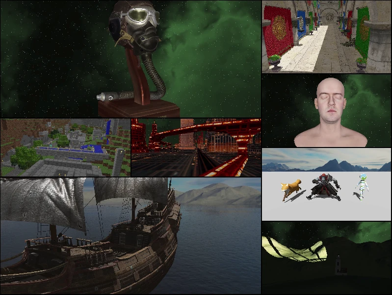

# Wired

<!-- Version and License Badges -->
 
 
 

Wired is a cross-platform, C++23, 2D/3D, game and render engine.

The Wired Renderer currently ships with a Vulkan-based GPU implementation.

## Screenshots


*A collage of test scenes rendered with the Wired engine*

## High-Level Features

- Cross Platform
- 2D & 3D Rendering
- Entity Component System
- Asset Loading System
- Point, Spot, and Directional Lights
- Single, Cubic, and Stabilized Cascaded Shadow Mapping
- Material, Mesh, and Texture Systems
- PBR lighting
- Heightmap Mesh Generation
- Compute-Based GPU Culling, LOD Selection, Post Processing
- Node and Skeleton-Based Model Animations
- 3D Physics System
- Global and 3D Spatialized Audio System
- Player Controller
- Input Handling

## Sample Client

Below is a complete code example for writing a client program which uses Wired to open a window, load a package from disk, and render a glb model in 3D space.

```
#include <Wired/Engine/DesktopEngine.h>
#include <Wired/Engine/IPackages.h>
#include <Wired/Engine/World/Components.h>

namespace Wired
{
    struct TestClient : public Engine::Client
    {
        public:

            void OnClientStart(Engine::IEngineAccess* pEngine) override
            {
                Engine::Client::OnClientStart(pEngine);

                LoadTestPackage();
                CreateModelEntity();
            }

        private:

            void LoadTestPackage()
            {
                const auto packageName = Engine::PackageName("TestPackage");

                // Blocking load/wait for our TestPackage to be loaded
                if (!engine->SpinWait(engine->GetPackages()->LoadPackageResources(packageName)))
                {
                    engine->Quit(); return;
                }

                // Fetch info about the loaded package resources
                m_packageResources = *engine->GetPackages()->GetLoadedPackageResources(packageName);
            }

            void CreateModelEntity()
            {
                const auto world = engine->GetDefaultWorld();

                // Create an entity in the default world
                const auto entityId = world->CreateEntity();

                // Attach a transform component to the entity
                auto transformComponent = Engine::TransformComponent{};
                transformComponent.SetPosition({0,0,-5});
                Engine::AddOrUpdateComponent(world, entityId, transformComponent);

                // Attach a model component to the entity
                auto modelComponent = Engine::ModelRenderableComponent{
                    .modelId = m_packageResources.models.at("CesiumMan.glb")
                };
                Engine::AddOrUpdateComponent(world, entityId, modelComponent);
            }

        private:

            Engine::PackageResources m_packageResources{};
    };
}

int main(int, char *[])
{
    using namespace Wired;

    auto desktopEngine = Engine::DesktopEngine{};
    if (!desktopEngine.Initialize("DemoApp" /* app name */ , {0,0,1} /* app version */, Engine::RunMode::Window))
    {
        return 1;
    }

    desktopEngine.ExecWindowed("DemoApp" /* window name */, {1000,1000} /* window size */, std::make_unique<TestClient>());

    desktopEngine.Destroy();

    return 0;
}
```
  
## Building The Engine

Have available on the command line:
- CMake
- Python3 (If using any of the helper scripts)
- A C++ compiler

### Option 1 - Using the build script
The ```build.[sh/bat]``` script will configure dependencies, invoke CMake, and build (a distro build of) the engine for you.

### Option 2 - Building manually
The engine is defined by a typical CMake project, located in src.

The ```external/prepare_dependencies.[sh/bat]``` helper script uses vcpkg to fetch the engine's dependencies. It will create a local vcpkg repo and install the engine's dependencies into it.

Either use the prepare_dependencies script or provide dependencies manually to CMake later via your own means.

The ```CMakePresets.json``` file defines configurations for typical build presets. Preset names follow the pattern: ```desktop-[debug/release/distro]-[windows/linux]```.

Set ```BUILD_SHARED_LIBS ON/OFF``` for whether to build Wired as shared or static libraries.

**Sample CMake invocation:**
``` cmake src --preset desktop-debug-linux -DBUILD_SHARED_LIBS=OFF ```

See also: The ```build.sh``` script, which does the above for you.
