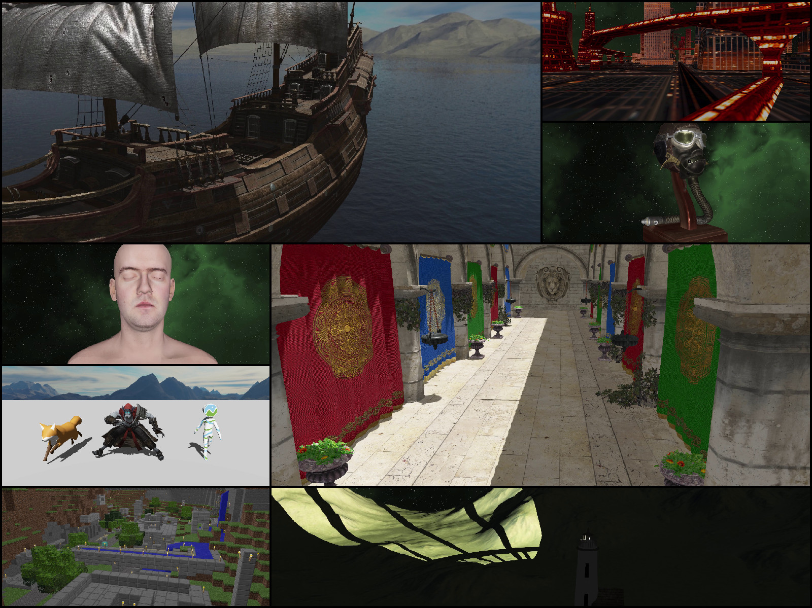

# Wired

<!-- Version and License Badges -->
 
 
 

Wired is a cross-platform, C++23, 2D/3D, game and render engine.

The Wired Renderer currently ships with a Vulkan-based GPU implementation.

## Screenshots



## Tech Demo Video

[](https://youtu.be/R-enitNsDyU)

## High-Level Features

- Cross Platform
- 2D & 3D Rendering
- Entity Component System
- Asset Loading System
- Point, Spot, and Directional Lights
- Single, Cubic, and Stabilized Cascaded Shadow Mapping
- Material, Mesh, and Texture Systems
- PBR lighting
- Heightmap Mesh Generation
- Compute-Based GPU Culling, LOD Selection, Post Processing
- Node and Skeleton-Based Model Animations
- 3D Physics System
- Global and 3D Spatialized Audio System
- Player Controller
- Input Handling

## Using Wired

1) Download the latest SDK release from the releases tab and extract it
2) Configure your project to link against the Wired binaries/headers (see instructions below if your project uses CMake)
3) Copy the sdk's ```wired``` directory to your project's build output / runtime directory
4) Follow the details in the ```Sample Client``` section below for how to write code that uses Wired

On Windows, at runtime you will also need to have either added the SDK's ```bin``` directory to your system path, or have copied the DLLs from the SDK's ```bin``` directory to your project's build output / runtime directory.

### If using CMake

The SDK includes a WiredEngineConfig.cmake file for easy integration with your project.

Tell CMake where to find Wired, such as providing this parameter at configure time:

```-DCMAKE_PREFIX_PATH={/path/to/Wired}/cmake/WiredEngine```

You can then link to Wired in CMake via:

```
find_package(WiredEngine CONFIG REQUIRED)
target_link_libraries(YourProject PRIVATE Wired::WiredDesktop)
```


## Sample Client

A sample client can be found at the link below. It's a minimal example of using Wired to create a window, load a package's resources, and render a model in 3D space.

[Sample Client](https://github.com/neon-software-dev/Wired/blob/main/samples/sample_client.cpp)

--

If you want to use package loading functionality to load assets from disk (```LoadPackageResources```), a sample/stub disk package can be found at the link below. 

[Sample Package](https://github.com/neon-software-dev/Wired/blob/main/samples/PackageSample)

Note that the package must be located in the runtime ```wired``` directory, placed under ```packages/{package_name}```.

*(Also note that models must be in their own subdirectory under assets/models, with the directory name matching the model file name, as demonstrated in the sample package).*
  
